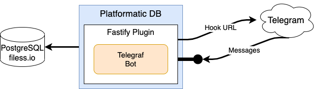

# telegram-bot-give-away

Open a new chat with [@eommGiveAwayBot](https://t.me/eommGiveAwayBot) and follow the instructions to create or join a new giveaway!

## Commands

- `/start` - Start the bot
- `/help` - Show help
- `/create` - Create a new giveaway. You need to answer 5 questions to create a new giveaway:
  1. Event name: short name of the event
  2. Event description: long description of the event. Don't forget to include the rules and the exctraction date!
  3. Event prize: what is the prize of the giveaway?
  4. Number of winners: how many winners will be extracted?
  5. Event code: the code to join the event. You will spam this code to let people join the event!
- `/join` - Join an existing giveaway. You will need to provide the event code.
- `/list` - List all the giveaways you created or joined.
- `/extract` - List all the giveaways you created and select one to extract the winners! The winners will receive a notification and the giveaway will be closed.
- `/abort` - Interrupt the current action when the bot expects an answer from you.

## Architecture

- This bot is built using [Telegraf](https://telegraf.js.org/) on top of [Fastify](https://www.fastify.dev/).
- It is deployed on [Platformatic](https://platformatic.cloud/).
- The Postgres database is hosted on [filess.io](https://www.filess.io/).
- The avatar of the bot is created using [Leonardo.AI](https://leonardo.ai/).

## Development

To run it locally you need to create a `.env` file with the variables listed in `.env.sample`.
Then you can setup the polling mode or the webhook mode with `ngrok http 3001`.

## License

Licensed under [MIT](./LICENSE).
